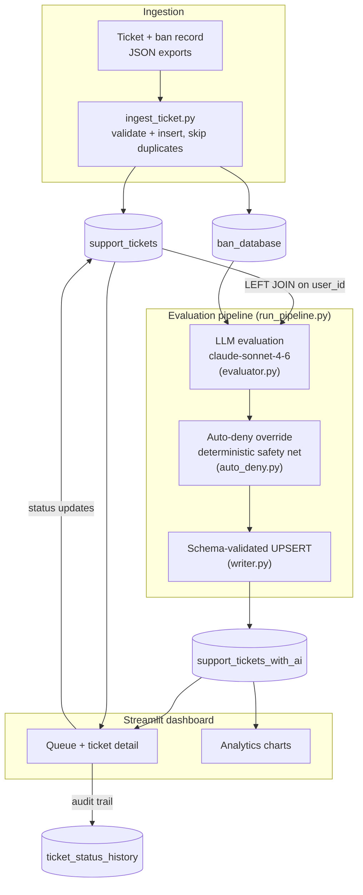
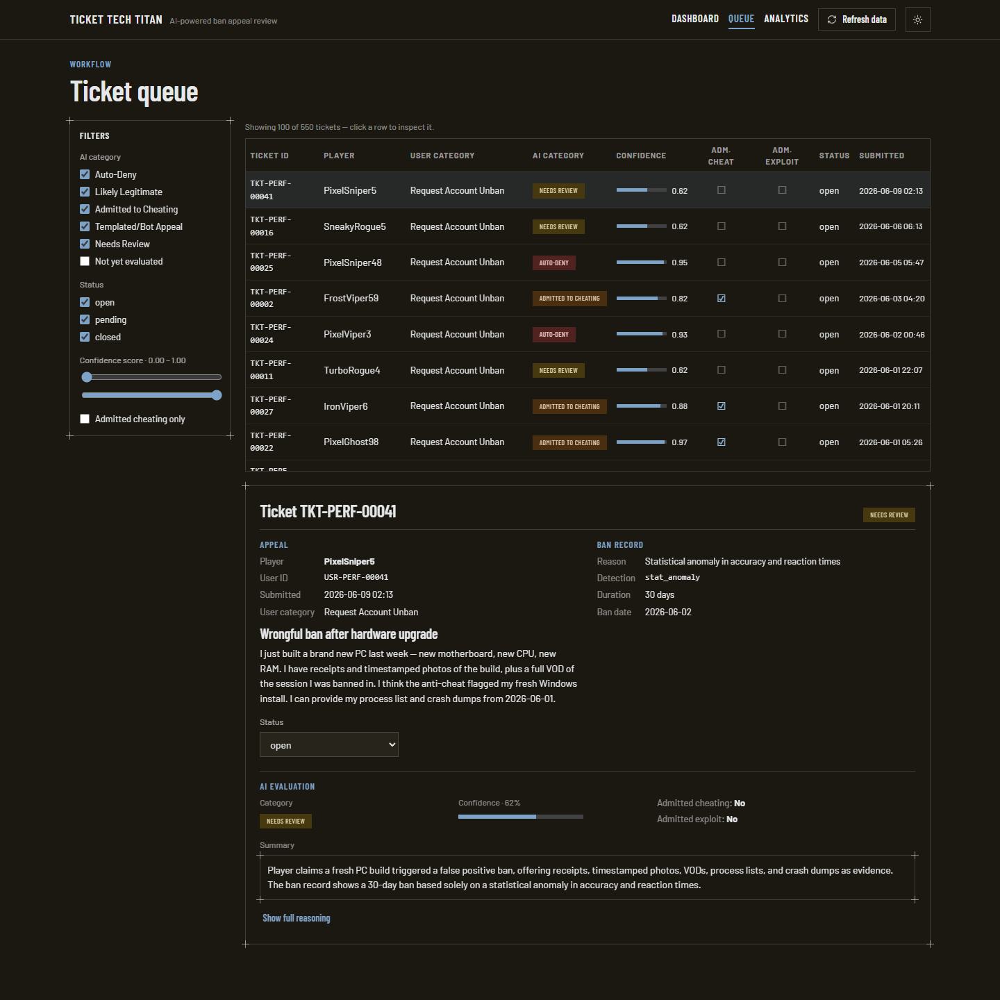
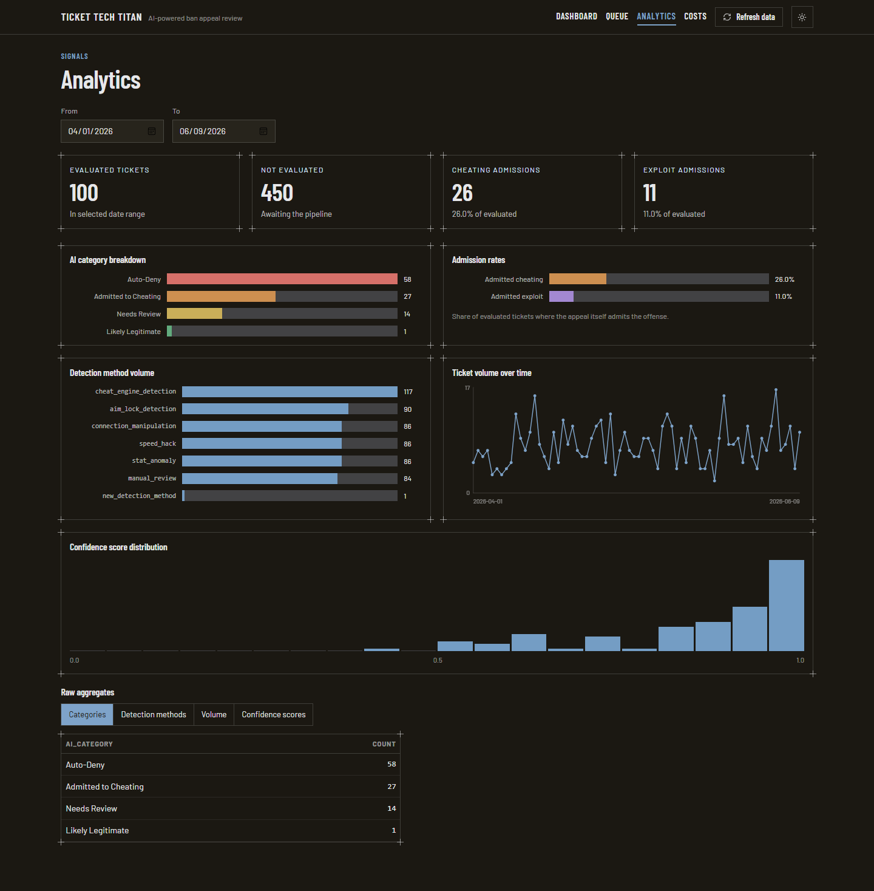

# Ticket Tech Titan


[](https://github.com/SerMike/Ticket-Tech-Titan/actions/workflows/ci.yml)


AI-powered triage for game ban-appeal tickets: an LLM reads each ban appeal against the internal ban evidence, summarizes it for analysts, sorts it into one of five priority buckets, and a deterministic rule layer guarantees confirmed cheaters can't talk their way out. All ban appeals in this workflow is reviewed by a human and this process is mainly for prioritizing genuine ban appeals to be surfaced to a human reviewer and prevent a player from being delayed a response because of unnecessary bot templated appeals gumming up the works. 

## Why I built this

As a Security Data Analyst on Bungie's Product Security team, I spent 3–4 hours of every workday triaging Destiny 2 ban-appeal tickets. The routine was always the same: open a ticket, read the appeal, look up the player's profile in a separate internal tool, review the case and conclude, most of the time, that the ban was justified and none of it had needed my attention. Worse, a flood of templated, botnet-generated appeals buried the tickets that actually mattered: the rare players who might have been banned mistakenly or accidentally.

Classical machine learning couldn't fix this. The appeal body is a freeform field where players write long, winding appeals, and traditional classifiers broke down on them quickly. An LLM doesn't: it digests a rambling appeal into a 2–3 sentence summary, weighs the player's claims against the internal ban evidence, and returns its judgment as strict JSON that flows straight back into a database. You end up with the best of both worlds: the programmatic, deterministic value of a traditional data pipeline with the flexibility of a model that can actually read. The first version was conceived in late 2023 on the GPT-3.5 API (the only commercial model available at the outset) and deployed in January 2024 after a 3–4 month build alongside a project manager, a data scientist, and a data engineer. My daily triage time dropped from 3–4 hours to 20 minutes–1 hour depending on if we implemented new detection in a ban wave, and the team later helped adapt the workflow to wider player-support queries so urgent requests surfaced faster with better priorities.

This repository is a (very) rough from-scratch rebuild of that system, using synthetic data and Claude Sonnet 4.6 in place of confidential tickets and the original model. The real thing took many people months to cultivate, iterate on, test, deploy, and test again. This rebuild exists to show concretely that AI in a production workflow delivers a meaningful return on time and investment and to document what that takes in practice: prompt engineering grounded in real ban policy, schema design that treats model output as untrusted input, and an architecture that stays fully testable without a database or an API key.

## Architecture



## Screenshots

**Ticket queue** — AI-triaged queue with category tags and confidence scores, plus the per-ticket detail view pairing the player's appeal with the internal ban record and the AI's evaluation:



**Analytics** — category breakdown, admission rates, detection-method volume, ticket volume over time, and confidence distribution:



## Quickstart

### Zero setup — run the tests

The unit suite needs no database, no API key, and no configuration:

```
pip install -r requirements.txt -r requirements-dev.txt
pytest
```

### Full demo — Docker

Requires Docker and an [Anthropic API key](https://console.anthropic.com/).

```
docker compose up -d                  # PostgreSQL 16 on localhost:5432
copy .env.example .env                # then set ANTHROPIC_API_KEY and the
                                      # docker DATABASE_URL shown in the file
python database/init_db.py            # schema + ticket categories
python ingestion/ingest_ticket.py --tickets data/sample_tickets.json --bans data/sample_bans.json
python evaluation/run_pipeline.py --limit 5    # ~5 cents of API spend
streamlit run dashboard/app.py        # http://localhost:8501
```

Drop `--limit 5` to evaluate all 50 sample tickets (well under a dollar).

<details>
<summary><b>Using your own PostgreSQL instead of Docker</b></summary>

1. Create a database named `ticket_tech_titan`.
2. Copy `.env.example` to `.env` and set `DATABASE_URL` to your instance plus your `ANTHROPIC_API_KEY`.
3. Create and activate a virtual environment, then `pip install -r requirements.txt`.
4. Continue from `python database/init_db.py` above.

</details>

## Key design decisions

- **The LLM proposes; deterministic rules dispose.** [`auto_deny.py`](evaluation/auto_deny.py) overrides the model's category to Auto-Deny whenever the ban record carries a confirmed technical detection (cheat-engine signature, aim-lock, speed-hack, connection manipulation) — a persuasive appeal can never talk a confirmed cheater out of a ban, no matter what the model says.
- **Model output is untrusted input.** Every response is parsed and schema-validated in [`evaluator.py`](evaluation/evaluator.py) — required fields, category whitelist, strict booleans, confidence range — before anything touches the database. Malformed output marks the ticket for review; it never corrupts a row.
- **Idempotent by construction.** Evaluations UPSERT on `ticket_id` ([`writer.py`](evaluation/writer.py)) and the pipeline commits per ticket, so re-runs are safe, re-evaluations replace rather than duplicate, and one bad ticket can't poison a batch.
- **Offline-testable layering.** 58 tests run with no database or API key — the DB layer, LLM client, and orchestration are all mockable seams. Integration tests exist but are opt-in (`pytest -m integration`).

## Performance

Sequential throughput is **~6.2 s/ticket**, almost entirely API-bound (one synchronous LLM call per ticket); the database layer answers every dashboard query in **32–45 ms with 550 tickets** loaded. Per-ticket commits make the pipeline embarrassingly parallel when throughput matters. Full methodology and numbers: [docs/performance-notes.md](docs/performance-notes.md).

## Running the dashboard

```
streamlit run dashboard/app.py
```

Opens at http://localhost:8501. The dashboard has three pages:

| Page | URL | Purpose |
|------|-----|---------|
| Dashboard | `/` | Summary metrics — open tickets, auto-denies today, needs-review backlog |
| Queue | `/queue` | Filterable ticket table; click any ticket to read the full appeal, ban record, and AI evaluation, and update its status |
| Analytics | `/analytics` | Plotly charts — category breakdown, admission rates, detection methods, volume over time |

Use the **🔄 Refresh data** button in the sidebar to pull the latest DB state at any time.

## Running tests

58 tests: 55 unit tests that run fully offline (no DB, no API key) plus 3 integration tests gated behind a marker.

```
pytest                        # unit tests only — no DB or API key required
pytest -m integration         # integration tests (live PostgreSQL; idempotency test uses 2 API calls)
pytest --cov=evaluation --cov=ingestion --cov=config --cov=dashboard --cov-report=term-missing
```

## Project structure

```
dashboard/          Streamlit UI
  app.py            Landing page + summary metrics
  db.py             All DB queries (read + status update)
  pages/
    01_queue.py     Ticket queue with filters and detail view
    02_analytics.py Aggregate charts

database/
  schema.sql        PostgreSQL schema
  init_db.py        One-shot schema initialiser

ingestion/
  ingest_ticket.py  JSON ticket + ban record ingestor

evaluation/
  prompts.py        System prompt + user-prompt builder
  client.py         Anthropic wrapper with logged retry/backoff
  evaluator.py      Claude-powered ticket classifier
  auto_deny.py      Deterministic override rules
  writer.py         Persist evaluations to DB
  run_pipeline.py   End-to-end pipeline runner

analytics/          SQL analysis queries
reference/          Industry ban-policy reference docs
config/
  settings.py       DB connection, ALLOWED_STATUSES

tests/              55 offline unit tests + 3 opt-in integration tests
scripts/
  generate_tickets.py  Synthetic ticket/ban generator for perf testing
  smoke_client.py      Manual live-API smoke test
  smoke_evaluate.py    Manual end-to-end evaluation spot-check
docs/
  performance-notes.md Performance baseline + scaling analysis
```
